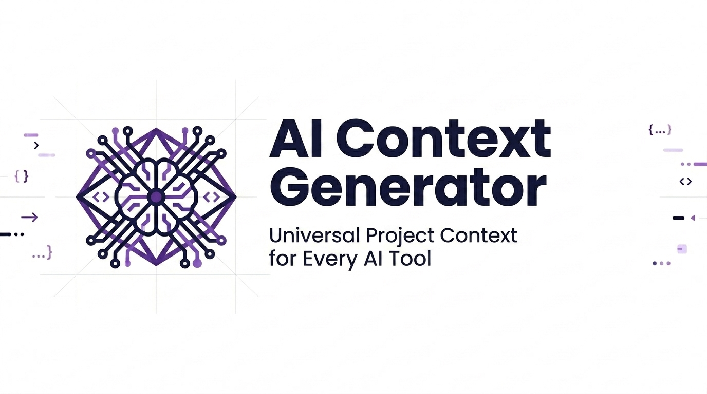

# AI Context Generator

<p align="center">
  
</p>

<p align="center">
  <a href="https://pypi.org/project/ai-context-generator/"></a>
  <a href="https://github.com/edsoncarlosdevops/ai-context-generator/releases"></a>
  <a href="https://github.com/marketplace/actions/ai-context-generator"></a>
  <a href="https://opensource.org/licenses/MIT"></a>
  <a href="https://github.com/edsoncarlosdevops/ai-context-generator/stargazers"></a>
  <a href="https://github.com/edsoncarlosdevops/ai-context-generator/actions"></a>
  <a href="https://codecov.io/gh/edsoncarlosdevops/ai-context-generator"></a>
  <a href="https://github.com/edsoncarlosdevops/ai-context-generator/commits/main"></a>
</p>

Scan any repository and automatically generate AI context files — `AGENTS.md`, `.cursorrules`, `CLAUDE.md`, `.windsurfrules`, `.clinerules`, and more. The universal governance layer that makes every AI coding assistant understand your project's architecture, standards, and conventions.

> Works with Cursor, Windsurf, Claude Code, GitHub Copilot, Cline, Amazon Q, Continue.dev, Zed AI, Aider, Antigravity, and any LLM-based tool that reads project context files.

---

## 📚 Documentation

| Doc | Description |
|-----|-------------|
| [Getting Started](./docs/getting-started.md) | Install, run, and secure your API key |
| [Configuration Reference](./docs/configuration-reference.md) | Every `.ai_context.toml` option |
| [CI/CD Integration](./docs/ci-cd-integration.md) | GitHub Actions, pre-commit, Azure DevOps, GitLab CI |
| [Architecture](./docs/architecture.md) | How the scanner → analyzer → prompt → LLM pipeline works |
| [Contributing](./docs/contributing.md) | Build, test, lint, type-check and submit PRs |

---

## The Problem

Every AI coding assistant reads a different context file:

| Tool | File it reads |
|------|--------------|
| Cursor | `.cursorrules` |
| Windsurf (Codeium) | `.windsurfrules` |
| Claude Code | `CLAUDE.md` |
| GitHub Copilot | `.github/copilot-instructions.md` |
| Cline | `.clinerules` |
| Amazon Q Developer | `.amazonq/rules/project-rules.md` |
| Continue.dev | `.continue/rules.md` |
| Zed AI | `.rules` |
| Aider | `CONVENTIONS.md` |
| Antigravity / AI PR Reviewer | `AGENTS.md` |

Maintaining all of them by hand is redundant, error-prone, and quickly becomes outdated as your project evolves.

---

## The Solution

`ai-context-generator` scans your codebase once, generates a single `AGENTS.md` as the **source of truth**, and automatically creates lightweight pointer files for every AI tool your team uses — with zero duplication.

```
Your Codebase
     │
     ▼
ai-context-generator (scan + LLM analysis)
     │
     ▼
AGENTS.md ─── Single Source of Truth
     │
     ├──► .cursorrules          (Cursor)
     ├──► .windsurfrules        (Windsurf)
     ├──► CLAUDE.md             (Claude Code)
     ├──► .github/copilot-instructions.md  (GitHub Copilot)
     ├──► .clinerules           (Cline)
     ├──► .amazonq/rules/       (Amazon Q)
     ├──► .continue/rules.md    (Continue.dev)
     ├──► .rules                (Zed AI)
     └──► CONVENTIONS.md        (Aider)
```

**Opt-in bridge model:** When you have a `[output]` section in `.ai_context.toml`, only the bridges you explicitly list are generated — keeping your repo clean. With no config at all, the tool generates all bridges on first run (maximum compatibility). This means your project root stays minimal: if you only use Cursor and Claude, only `.cursorrules` and `CLAUDE.md` are created.

**Smart updates (cost-saving):** The tool stores a lightweight `.ai-context.sig` signature file in your repo. When the detected project profile is unchanged, the paid LLM call is **skipped entirely** and the existing `AGENTS.md` is kept. When the profile does change, the generated content is compared with the current file — if the architecture hasn't changed significantly (less than 10% diff), no files are written, keeping your git history clean. Commit `.ai-context.sig` alongside `AGENTS.md` to benefit in CI.

**Grounded in your actual repository.** The generator does not just send a list of
detected frameworks to the LLM. It also sends the real directory layout, entry
points, root config files, direct dependencies and the build/test commands it
verified in your manifests — and the prompt forbids referencing anything that is
not in that evidence. Fewer generic rules, more rules a reviewer can actually check.

**Safe against untrusted repositories.** An existing `AGENTS.md` is fed back to the
model fenced as untrusted data, with injected fence markers stripped, so a hostile
file in a scanned repository cannot hijack the generator.

---

## Ecosystem

```
ai-context-generator  ──generates──►  AGENTS.md  ──consumed by──►  ai-pr-reviewer
                                           │
                       All AI IDEs and assistants read the same source of truth
```

Used together with [ai-pr-reviewer](https://github.com/edsoncarlosdevops/ai-pr-reviewer), every Pull Request is reviewed by an AI that already understands your project's architecture, security requirements, and coding standards.

---

## Quick Start

### ⚡ Zero-Install CLI (Recommended for fast local testing)

No installation required using `uvx` or `pipx`:

```bash
# Run instantly with uvx
uvx ai-context-generator generate --workspace . --api-key $AI_API_KEY

# Or with pipx
pipx run ai-context-generator generate --workspace . --api-key $AI_API_KEY

# Dry-run preview without writing files
uvx ai-context-generator generate --dry-run
```

### 📦 Standard Pip Install

```bash
pip install ai-context-generator

# Run in your project root
export AI_API_KEY="sk-..."
ai-context-generator generate --workspace .
```

> 🔐 **Never pass your key on the command line in production.** Prefer the
> `AI_API_KEY` (or `OPENAI_API_KEY`) environment variable, or a `.env` file in your
> workspace root (loaded automatically, and already in `.gitignore`). A key passed
> via `--api-key` can end up in your shell history.

### 🪝 Pre-Commit Hook Integration

Add `ai-context-generator` to your `.pre-commit-config.yaml` to keep context files updated before every commit:

> **Note:** the hook runs on every commit (`always_run`) and requires an API key via `AI_API_KEY` (or `OPENAI_API_KEY`) in the environment. It is cheap in practice — when the repository profile hasn't changed, the LLM call is skipped automatically.

```yaml
repos:
  - repo: https://github.com/edsoncarlosdevops/ai-context-generator
    rev: v2.0.0
    hooks:
      - id: ai-context-generator
```

### 🤖 GitHub Actions

Add to `.github/workflows/ai-context.yml`:

```yaml
name: Generate AI Context
on:
  workflow_dispatch:
  schedule:
    - cron: '0 9 * * 1'  # Every Monday

jobs:
  generate:
    runs-on: ubuntu-latest
    permissions:
      contents: write
      pull-requests: write
    steps:
      - uses: actions/checkout@v4
      - uses: edsoncarlosdevops/ai-context-generator@v2
        with:
          ai_api_key: ${{ secrets.DEEPSEEK_API_KEY }}
          model: deepseek-chat
          create_pr: 'true'
```

---

## 🏷️ Add Badge to Your Project README

Show that your project maintains universal AI governance by adding this badge to your README:

[](https://github.com/edsoncarlosdevops/ai-context-generator)

```markdown
[](https://github.com/edsoncarlosdevops/ai-context-generator)
```

---

## Configuration

All options live in a `.ai_context.toml` file at your repository root — **the file is
entirely optional** (sensible defaults are built in). The two most important knobs:

```toml
[generator]
model = "deepseek-chat"    # BYOM: any OpenAI-compatible endpoint
language = "english"       # english, portuguese, spanish, french, german
max_lines = 150
timeout = 120.0            # seconds per LLM call
max_retries = 3            # attempts for rate-limit / 5xx / connection errors

[scan]
# Merged on top of the built-in defaults — never replaces them, so you can
# never accidentally start scanning node_modules by adding one entry here.
exclude_dirs = ["my_generated_dir"]
max_file_size_kb = 100
max_files = 100000         # hard cap for huge monorepos
use_gitignore = true       # also skip plain directory names from .gitignore
```

Sensible directory exclusions ship out of the box (`node_modules`, `venv`,
`target`, `vendor`, `.next`, `dist`, `build`, `coverage`, `.terraform`, …), and
plain directory names from your `.gitignore` are skipped too.

**Scriptable output.** `--json` prints a machine-readable summary, with or without
`--dry-run`:

```bash
ai-context-generator generate --dry-run --json | jq '.domain, .frameworks'
```

**Bridge files stay clean.** The tool automatically creates a `.gitattributes` file
marking all generated bridges as `linguist-generated`, so they collapse in GitHub PR
diffs and don't count toward your language statistics.

> 📖 Full reference — including every bridge flag, CLI override and env var — in
> [docs/configuration-reference.md](./docs/configuration-reference.md).

### Pipeline Integration

Add path triggers to update context files automatically when your project structure
changes. Full GitHub Actions, pre-commit, Azure DevOps and GitLab CI recipes:

> 📖 [docs/ci-cd-integration.md](./docs/ci-cd-integration.md)

---

## BYOM — Bring Your Own Model

| Provider | Model | Base URL |
|----------|-------|----------|
| DeepSeek | `deepseek-chat` | `https://api.deepseek.com` |
| OpenAI | `gpt-4o`, `gpt-4-turbo` | `https://api.openai.com/v1` |
| Anthropic | `claude-3-5-sonnet-20241022` | `https://api.anthropic.com/v1` |
| Ollama (local) | `llama3`, `mistral`, `codestral` | `http://localhost:11434/v1` |
| Any OpenAI-compatible | any | custom `base_url` |

```bash
# Prefer environment variables — no key on the command line
export AI_API_KEY="$MY_KEY"
ai-context-generator generate --model gpt-4o --workspace .
```

For Ollama locally, use a dummy key and a custom `base_url`:

```bash
ai-context-generator generate --workspace . --api-key dummy \
  --base-url http://localhost:11434/v1 --model llama3
```

Model, base URL and language can also come from the environment
(`AI_CONTEXT_MODEL`, `AI_CONTEXT_BASE_URL`, `AI_CONTEXT_LANGUAGE`), which is handy
in CI. Precedence is **CLI flags > environment > `.ai_context.toml` > defaults**.

---

## Upgrading to 2.0

The CLI, the `.ai_context.toml` format and the GitHub Action are **unchanged** —
`ai-context-generator generate` works exactly as before.

One breaking change affects anyone importing the package in Python: the top-level
module was renamed from the generic `core` to `ai_context_generator`, so that
installing this package no longer squats the `core` name in your environment.

```diff
- from core.scanner import CodebaseScanner
+ from ai_context_generator.scanner import CodebaseScanner
```

If you invoked the module directly, use `python -m ai_context_generator.cli`
(or just the `ai-context-generator` console script).

---

## License

MIT — [edsoncarlosdevops](https://github.com/edsoncarlosdevops)
